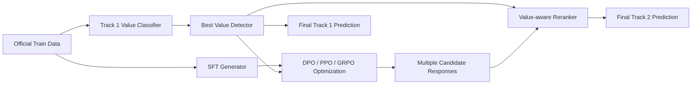

# 基于监督对比价值检测器与偏好优化生成模型的人类价值观检测与对齐系统

## 摘要

细粒度人类价值观理解与对齐是大语言模型安全可信应用中的重要问题。NLPCC 2026 Shared Task 2 围绕 Schwartz 基本价值观理论，设置了价值检测与指定价值响应生成两个子任务：Track 1 要求系统从给定回答中识别其主导人类价值观，Track 2 要求系统根据场景、问题与目标价值观生成语义有效且价值一致的回答。本文介绍我们面向该评测任务构建的双阶段系统。对于 Track 1，我们比较了 BERT、DeBERTa-v3-large 与 DeBERTa-v2-XXLarge 等编码器模型，并结合类别加权交叉熵、R-Drop、监督对比学习以及 MoCo 风格的监督对比学习，以缓解类别不均衡并增强细粒度价值类别的表征区分能力。对于 Track 2，我们以 Qwen3.5-9B 为基础模型，依次探索监督微调、直接偏好优化、PPO 与 GRPO 等训练策略，并进一步使用 Track 1 最优价值检测器作为自动价值评估器，对多候选生成结果进行重排序。实验结果表明，DeBERTa-v2-XXLarge + MoCo-SCL 在 Track 1 验证集上取得 94.94% Accuracy 和 0.9429 Macro-F1；在 Track 2 的内部价值匹配评估中，GRPO 结合价值感知重排序取得最高的目标价值匹配率。进一步分析显示，监督对比学习能够改善语义相近价值类别之间的边界，而基于组内相对奖励的 GRPO 相比 PPO 具有更稳定的价值对齐效果。

**关键词**：人类价值观；Schwartz 基本价值观；价值检测；价值对齐；监督对比学习；偏好优化；GRPO

## 1 引言

随着大语言模型在教育、医疗、心理咨询、公共服务等高影响场景中的广泛应用，模型输出是否能够体现稳定、可解释且符合人类偏好的价值取向，逐渐成为安全可信人工智能研究中的重要问题。现有大语言模型对齐研究通常关注有害内容规避、指令遵循和一般性偏好满足，而对细粒度心理学价值维度的系统建模仍相对不足。Schwartz 基本价值观理论将人类价值划分为 19 个细粒度类别，例如 Self-direction、Achievement、Conformity、Benevolence 与 Universalism 等，为研究模型输出中的价值倾向提供了理论基础。

NLPCC 2026 Shared Task 2: Schwartz’s Basic Human Values’ Detection and Alignment with LLMs 针对这一问题设计了两个评测任务。Track 1 是细粒度价值检测任务，要求系统根据回答文本判断其体现的主导价值观；Track 2 是指定价值响应生成任务，要求系统在给定场景、问题与目标价值观的情况下，生成既回答问题又更好体现目标价值的文本。两个任务虽然评测目标不同，但具有天然联系：高质量的价值检测器不仅可以用于 Track 1 的分类预测，也可以作为 Track 2 生成系统中的自动价值评估器、奖励模型或候选重排序器。

基于这一观察，本文提出一个面向双 Track 的统一系统框架。系统首先训练细粒度价值检测器，在 19 类 Schwartz 价值标签上学习稳定的文本表征。考虑到任务数据存在明显类别不均衡，且部分类别之间语义边界较近，我们在编码器分类模型中引入类别加权交叉熵、R-Drop 正则化、监督对比学习以及 MoCo 风格的队列式监督对比学习。随后，在生成任务中，我们基于 Qwen3.5-9B 构建价值对齐生成器。系统先通过监督微调学习任务格式和回答风格，再利用数据集中 `Consistent Value Response` 与 `Contrastive Response` 构造偏好对进行 DPO 训练，并进一步探索 PPO 与 GRPO 等基于奖励的优化方法。最后，对于每个测试样本，系统生成多个候选回答，并使用 Track 1 最优检测器对候选回答的目标价值概率与分类 margin 进行打分，从而选择最符合目标价值的最终输出。

本文的主要贡献如下：

1. 我们构建了一个面向 19 类 Schwartz 基本价值观的细粒度检测系统，系统比较了多种编码器模型与训练策略，并验证了 MoCo 风格监督对比学习在细粒度价值分类中的有效性。
2. 我们将价值检测器进一步用于响应生成任务，作为自动价值评估器和候选重排序器，使 Track 1 与 Track 2 形成统一的检测-生成闭环。
3. 我们系统比较了 SFT、DPO、PPO 和 GRPO 在价值对齐生成任务中的表现，发现 DPO 能稳定提升生成回答的价值一致性，而 GRPO 在内部价值匹配指标上取得最佳结果。
4. 我们从类别级结果和案例分析两个角度讨论了不同训练策略的优缺点，为细粒度价值对齐任务中的奖励设计与候选选择提供了经验参考。

## 2 任务与数据

### 2.1 任务定义

本评测任务包含两个子任务。

**Track 1: Fine-grained Value Detection.** 给定一条与某种 Schwartz 基本价值观一致的回答文本，系统需要预测该回答体现的主导价值类别。该任务可形式化为 19 类文本分类问题。对于输入回答 $r$，模型需要输出标签 $\hat{y} \in \mathcal{Y}$，其中 $\mathcal{Y}$ 表示 19 个 Schwartz 基本价值观类别。

**Track 2: Response Generation of Specific Human Value.** 给定场景 $s$、问题 $q$ 与目标价值 $y$，系统需要生成回答 $r$。生成回答应同时满足两个要求：一是能够针对问题给出有意义的回应，二是相比参考回答更充分地体现指定目标价值。官方评测采用 LLM-as-a-Judge 的方式判断生成回答是否在内容有效性和价值一致性上优于参考回答。

### 2.2 数据集

官方数据以 jsonl 格式提供。每条样本包含 `Scenario`、`Question`、`Value`、`Consistent Value Response` 和 `Contrastive Response` 五个字段。其中，`Consistent Value Response` 是与目标价值更一致的回答，`Contrastive Response` 是相对更弱或更不符合目标价值的回答。Track 1 使用 `Consistent Value Response` 作为输入文本，以 `Value` 作为分类标签；Track 2 使用 `Scenario`、`Question` 和 `Value` 作为输入，并生成新的 `Consistent Value Response`。

本系统仅使用官方提供的训练集和验证集进行监督训练与验证，没有使用额外监督或无监督外部数据。训练集包含 3,520 条样本，验证集包含 514 条样本。标签空间包含 19 类 Schwartz 基本价值观。训练集中类别分布不均衡，最少类别 Universalism-tolerance 仅有 68 条样本，最多类别 Stimulation 有 400 条样本，最大最小类别样本数相差约 6 倍。该不均衡分布是我们在 Track 1 中采用类别加权损失和对比学习的重要动机。

## 3 系统概览

我们设计的系统由价值检测模块和价值生成模块两部分组成。整体流程如图 1 所示。



Track 1 中，我们将价值检测建模为文本分类任务，主要探索 encoder-based 方法。系统最终选择 DeBERTa-v2-XXLarge 作为主干模型，并通过 LoRA 进行参数高效微调。训练目标由类别加权交叉熵和 MoCo 风格监督对比损失共同构成，以同时提升分类准确性与表示空间的类别分离度。

Track 2 中，我们以 Qwen3.5-9B 为基础生成模型。首先使用监督微调使模型学习任务指令、输出格式和参考回答风格；然后使用 DPO 对 `Consistent Value Response` 和 `Contrastive Response` 偏好对进行优化；进一步地，我们使用 Track 1 最优分类器作为自动奖励模型，尝试 PPO 和 GRPO 等强化学习式优化方法。推理阶段，我们对每个样本采样多个候选回答，并使用 Track 1 价值检测器计算每个候选对目标价值的概率和 margin，最终选择综合得分最高的候选作为提交结果。

## 4 方法

### 4.1 Track 1 价值检测模型

Track 1 的输入为回答文本，输出为 19 类价值标签。我们主要使用 `response_only` 输入形式，即仅将回答文本送入分类器，而不额外拼接场景和问题信息。这样做的原因是官方测试集中 Track 1 仅提供回答文本，训练和推理保持输入形式一致可以减少分布偏移。

给定输入文本 $x$ 和真实标签 $y$，编码器首先得到句向量表示 $h=f_\theta(x)$，分类头输出每个价值类别的概率分布：

$$
p_\theta(c|x)=\mathrm{softmax}(Wh+b)_c.
$$

基础分类损失为交叉熵。考虑到训练集中类别分布不均衡，我们使用类别加权交叉熵：

$$
\mathcal{L}_{ce}
= - w_y \log p_\theta(y|x),
$$

其中 $w_y$ 与类别 $y$ 的样本频次负相关，用于提高少数类样本在训练中的权重。

### 4.2 R-Drop 正则化

为了提升模型预测稳定性，我们在 BERT-base 实验中引入 R-Drop。对于同一输入样本，模型在 dropout 激活的情况下执行两次前向传播，得到两个预测分布 $p_1$ 和 $p_2$。R-Drop 同时优化两次交叉熵损失和双向 KL 一致性损失：

$$
\mathcal{L}_{rdrop}
= \mathcal{L}_{ce}^{(1)} + \mathcal{L}_{ce}^{(2)}
+ \alpha \cdot \frac{1}{2}
\left[
\mathrm{KL}(p_1||p_2)+\mathrm{KL}(p_2||p_1)
\right].
$$

该方法能够减少模型在小规模数据上的预测波动，并提升泛化能力。

### 4.3 监督对比学习与 MoCo-SCL

Schwartz 19 类价值观之间存在较强语义相关性。例如，Conformity-rules 与 Conformity-interpersonal 都涉及规范或关系约束，Benevolence-caring 与 Benevolence-dependability 都涉及对内群体的积极责任，Universalism-concern 与 Universalism-tolerance 都体现普遍主义取向。因此，仅依靠交叉熵分类目标可能难以学习清晰的类别边界。

为增强表征空间中的类别可分性，我们引入监督对比学习。对于 batch 中样本 $i$，其正样本集合 $P(i)$ 为与其标签相同的其他样本，对比学习损失定义为：

$$
\mathcal{L}_{scl}
= - \sum_i \frac{1}{|P(i)|}
\sum_{p \in P(i)}
\log
\frac{\exp(\mathrm{sim}(z_i,z_p)/\tau)}
{\sum_{a \ne i}\exp(\mathrm{sim}(z_i,z_a)/\tau)}.
$$

其中 $z_i$ 是归一化后的句向量，$\tau$ 为温度系数。该目标鼓励同类样本表示靠近、异类样本表示远离。

普通 SCL 的效果受 batch size 限制，尤其是在类别数较多且类别不均衡时，一个 batch 内可能缺少足够的同类正样本和困难负样本。为此，我们进一步采用 MoCo 风格的监督对比学习，维护一个 EMA key encoder 和固定长度的特征队列。当前 batch 中的 query 表示不仅与 batch 内样本对比，也与历史样本队列中的 key 表示对比，从而扩大有效对比样本规模。最终 Track 1 模型采用以下联合目标：

$$
\mathcal{L}
= \mathcal{L}_{weighted\_ce}
+ \lambda \mathcal{L}_{moco\_scl}.
$$

### 4.4 Track 2 监督微调

Track 2 的目标是在给定场景、问题与目标价值的情况下生成价值一致回答。我们使用如下 prompt 模板构造输入：

```text
You are given a scenario, a question, and a target human value.
Generate one concise, meaningful response that answers the question,
fits the scenario, and naturally aligns with the target value.

Scenario:
{Scenario}

Question:
{Question}

Target value:
{Value}

Target value definition:
{Value Definition}

Response:
```

监督微调阶段使用官方样本中的 `Consistent Value Response` 作为目标输出。SFT 的作用主要有三点：第一，使模型学习任务格式和回答长度；第二，使模型理解目标价值名称及其定义；第三，为后续 DPO、PPO 和 GRPO 提供稳定初始化。

### 4.5 基于偏好对的 DPO

官方数据同时提供 `Consistent Value Response` 和 `Contrastive Response`，这天然构成偏好优化样本。我们将 `Consistent Value Response` 作为 chosen response，将 `Contrastive Response` 作为 rejected response，并在 SFT adapter 的基础上进行 DPO 训练。

对于一条偏好样本 $(x,y_w,y_l)$，其中 $x$ 为 prompt，$y_w$ 为 chosen response，$y_l$ 为 rejected response。DPO 目标鼓励当前策略模型相对于冻结参考模型更偏好 chosen response：

$$
\mathcal{L}_{DPO}
= -\log \sigma \left(
\beta \left[
\log \frac{\pi_\theta(y_w|x)}{\pi_\theta(y_l|x)}
- \log \frac{\pi_{ref}(y_w|x)}{\pi_{ref}(y_l|x)}
\right]
\right).
$$

其中 $\pi_{ref}$ 是冻结的 SFT 模型，$\beta$ 控制偏好优化强度。相比单纯最大化 chosen response 概率，DPO 显式利用正负回答之间的相对偏好，更适合本任务中“相比参考回答更体现目标价值”的评测目标。

### 4.6 基于价值检测器的 PPO 与 GRPO

除 DPO 外，我们进一步探索使用 Track 1 价值检测器作为自动奖励模型进行强化学习式优化。对于模型生成的回答 $r$，Track 1 检测器输出 19 类价值概率分布。设目标价值为 $y$，目标价值概率为 $p(y|r)$，最强非目标类别概率为 $\max_{c \ne y} p(c|r)$，则 margin 定义为：

$$
m(r,y)=p(y|r)-\max_{c \ne y}p(c|r).
$$

我们构造的奖励主要由目标价值概率、margin、预测是否命中目标类别以及长度惩罚组成：

$$
R(r,y)
= p(y|r) + 0.25 \cdot m(r,y)
+ 0.10 \cdot \mathbf{1}[\arg\max_c p(c|r)=y]
- \mathrm{penalty}_{len}.
$$

PPO 阶段从 SFT adapter 初始化，使用上述奖励更新策略模型。然而在实验中，PPO 对奖励尺度和生成格式较敏感，部分生成结果出现语言不自然或格式残留问题。

GRPO 阶段同样从 SFT adapter 初始化，但不额外训练 value head 或 critic。对于同一个 prompt，模型采样一组回答，并根据组内 reward 的均值和标准差计算相对优势：

$$
A_{i,j}
= \frac{R_{i,j}-\mathrm{mean}(R_i)}
{\mathrm{std}(R_i)+\epsilon}.
$$

随后使用类似 PPO 的 clipped objective 更新模型：

$$
\mathcal{L}_{GRPO}
= -\mathbb{E}
\left[
\min
\left(
\rho_{i,j} A_{i,j},
\mathrm{clip}(\rho_{i,j},1-\epsilon,1+\epsilon)A_{i,j}
\right)
\right].
$$

GRPO 的核心优势在于，它比较同一个 prompt 下多个候选回答的相对质量，而不是依赖绝对奖励标定。因此在本任务中，GRPO 更适合结合价值检测器提供的 proxy reward。

### 4.7 候选生成与价值感知重排序

推理阶段，我们并不直接采用单次解码结果，而是为每个样本生成多个候选回答。随后使用 Track 1 最优检测器对每个候选回答进行打分。具体而言，对于候选回答 $r_k$，重排序分数为：

$$
S(r_k,y)=p(y|r_k)+0.25 \cdot m(r_k,y).
$$

最终选择分数最高的候选作为系统输出。该策略具有两个优点：一方面，它可以降低单次采样带来的随机性；另一方面，它将 Track 1 学到的价值判别能力显式迁移到 Track 2 生成任务中，使最终输出更稳定地体现目标价值。

## 5 实验设置

### 5.1 Track 1 设置

Track 1 中，我们比较了 encoder 和 decoder 两类方法。Encoder 方法包括 BERT-base、DeBERTa-v3-large 和 DeBERTa-v2-XXLarge；decoder 方法包括 Qwen3-4B SFT 分类式生成。实验主要使用 `response_only` 输入，以保证训练和测试条件一致。

主要训练策略包括：

- Weighted CE：用于缓解类别不均衡；
- R-Drop：用于增强预测一致性；
- SCL：用于提升类别表征分离度；
- MoCo-SCL：通过 EMA key encoder 和队列扩大对比样本规模；
- LoRA：用于降低 DeBERTa-v2-XXLarge 等大模型微调成本。

### 5.2 Track 2 设置

Track 2 中，基础生成模型为 Qwen3.5-9B。SFT 阶段使用官方训练集中的 `Consistent Value Response` 作为目标输出，最大长度设置为 896，学习率为 $1e^{-5}$，训练 3 个 epoch。DPO 阶段从 SFT adapter 初始化，使用 `Consistent Value Response` 和 `Contrastive Response` 构造偏好对，学习率为 $3e^{-6}$，$\beta=0.1$。

PPO 和 GRPO 均使用 Track 1 最优分类器作为 reward model。GRPO 中每个 prompt 采样 4 个候选回答，学习率为 $5e^{-7}$，clip 系数为 0.2，最大生成长度为 64。推理时，各模型均为每个样本生成约 4 个候选回答，并使用价值感知重排序选择最终输出。

## 6 实验结果

### 6.1 Track 1 价值检测结果

表 1 展示了不同 Track 1 方法在验证集上的结果。

**表 1：Track 1 验证集结果**

| 方法 | 输入形式 | Accuracy | Macro-F1 |
|---|---|---:|---:|
| DeBERTa-v3-large + Weighted CE | response only | 79.96 | 0.7901 |
| BERT-base + R-Drop | response only | 93.00 | 0.9235 |
| BERT-base + Weighted CE + SCL | response only | 93.00 | 0.9202 |
| DeBERTa-v2-XXLarge + Weighted CE | response only | 93.77 | 0.9324 |
| DeBERTa-v2-XXLarge + MoCo-SCL | response only | **94.94** | **0.9429** |
| Qwen3-4B SFT | response only | 88.13 | 0.8576 |
| Qwen3-4B SFT | full context to response only | 84.82 | 0.8187 |
| Qwen3-4B SFT | context dropout to response only | 85.99 | 0.8345 |

从结果可以看出，encoder-based 分类器明显优于 decoder-based 分类方法。BERT-base 结合 R-Drop 已能达到较强效果，而将主干模型升级为 DeBERTa-v2-XXLarge 后，性能进一步提升。在此基础上引入 MoCo-SCL 后，模型取得最佳结果，Accuracy 达到 94.94%，Macro-F1 达到 0.9429。这说明在 19 类细粒度价值检测中，强编码器模型和对比式表征学习都具有重要作用。

### 6.2 Track 2 内部价值匹配结果

由于官方 Track 2 使用 LLM-as-a-Judge 作为最终评测方式，我们在开发阶段使用 Track 1 最优分类器构造内部 proxy evaluation。该评估不能完全等同于官方指标，但可以衡量生成回答是否被价值检测器判定为目标价值。我们报告以下指标：

- `match_rate`：生成回答被 Track 1 分类器预测为目标价值的比例；
- `avg_target_prob`：Track 1 分类器分配给目标价值的平均概率；
- `avg_margin`：目标价值概率与最强非目标类别概率之间的平均差值；
- `avg_word_count`：最终回答的平均词数。

表 2 展示了不同生成方法在验证集上的内部价值匹配结果。

**表 2：Track 2 验证集内部价值匹配结果**

| 方法 | Match Rate | Avg Target Prob | Avg Margin | Avg Words |
|---|---:|---:|---:|---:|
| SFT | 0.9942 | 0.9921 | 0.9861 | 23.71 |
| DPO | 0.9981 | 0.9974 | 0.9954 | 27.78 |
| PPO | 0.9572 | 0.9510 | 0.9101 | 26.07 |
| GRPO | **1.0000** | **0.9989** | **0.9983** | 33.05 |

可以看到，SFT 已经能够生成较高价值一致性的回答，说明官方训练数据中的 consistent response 对模型学习任务格式和价值表达非常有效。DPO 在 SFT 基础上进一步提升 match rate、target probability 和 margin，表明 contrastive response 提供了有价值的偏好信号。PPO 在当前设置下表现低于 SFT 和 DPO，可能原因包括奖励尺度过强、模型更新不稳定以及生成格式残留。GRPO 取得最佳内部价值匹配结果，但同时平均回答长度增加到 33.05 个词，说明其倾向于生成更充分、更显式的价值表达。

表 3 展示了测试集上的内部价值匹配结果。该结果同样由 Track 1 分类器计算，仅作为系统开发阶段的 proxy 指标。

**表 3：Track 2 测试集内部价值匹配结果**

| 方法 | Match Rate | Avg Target Prob | Avg Margin |
|---|---:|---:|---:|
| SFT | 0.9805 | 0.9772 | 0.9570 |
| DPO | 0.9922 | 0.9920 | 0.9845 |
| PPO | 0.9689 | 0.9671 | 0.9396 |
| GRPO | **1.0000** | **0.9984** | **0.9971** |

测试集 proxy 结果与验证集趋势基本一致：DPO 稳定优于 SFT，GRPO 取得最高价值匹配率，PPO 则相对不稳定。

## 7 分析

### 7.1 MoCo-SCL 对价值检测的影响

Track 1 中，DeBERTa-v2-XXLarge + MoCo-SCL 取得最佳结果。我们认为这一提升主要来自两个方面。第一，Schwartz 价值类别之间存在细粒度语义差异，许多类别并非简单关键词即可区分。例如，Conformity-rules 更强调遵守规则和正式义务，而 Conformity-interpersonal 更强调避免伤害他人和维护关系；Benevolence-dependability 更强调可靠与可信，Benevolence-caring 更强调关心和照顾。第二，训练数据规模较小且类别不均衡，普通 batch 内的正负样本覆盖有限。MoCo-SCL 通过维护历史样本队列，使模型能够在更大的对比空间中学习类别边界，从而提高 Macro-F1。

### 7.2 SFT、DPO、PPO 与 GRPO 对比

Track 2 中，SFT 提供了强基线，因为目标回答本身已经具有较高质量。DPO 直接利用 consistent response 与 contrastive response 的偏好关系，使模型不仅学习“什么是好回答”，也学习“什么回答相对更弱”，因此能在 SFT 基础上稳定提升价值一致性。

PPO 的表现相对较弱。一方面，PPO 依赖绝对 reward 数值，若 Track 1 分类器对某些文本给出过高置信度，reward 可能饱和，导致有效学习信号不足；另一方面，PPO 训练过程中生成文本的格式稳定性较难控制，部分回答出现 prompt 残留或语言不自然现象。

GRPO 相比 PPO 更适合本任务。它不需要额外训练 critic，而是在同一 prompt 的多个候选回答之间进行相对比较。对于价值对齐生成而言，同一场景下不同候选回答的相对价值表达强弱通常比绝对 reward 更可靠。因此，GRPO 在验证集和测试集 proxy 指标上均取得最佳结果。

### 7.3 类别级分析

从类别级结果看，PPO 在部分语义边界较近或样本较少的类别上更容易出现错误。例如，在验证集中，PPO 对 Universalism-tolerance、Self-direction-thought、Security-societal 和 Benevolence-dependability 的匹配率相对较低。这些类别通常需要回答体现较抽象的价值取向，如对不同观点的接纳、独立思考、社会稳定或可靠合作，仅靠表层关键词可能不足以稳定区分。

相比之下，GRPO 在测试集 proxy 评估中所有类别均被 Track 1 检测器判定为目标价值，说明其生成回答的价值表达更加显式。不过，GRPO 的平均回答长度也更长，表明模型可能通过更充分甚至更模板化的价值解释来提高检测器置信度。这一现象提示我们，在后续工作中需要进一步平衡价值显式性、语言自然度和回答简洁性。

### 7.4 案例分析

表 4 给出一个 Universalism-nature 样例。该样例要求模型在湿地修复场景中决定预算优先用于公众教育标识还是入侵杂草清除。

**表 4：Universalism-nature 案例**

| 模型 | 生成回答 |
|---|---|
| SFT | I would allocate all resources to the physical removal of the invasive weeds, believing that the long-term health of the ecosystem is the absolute priority. |
| DPO | I would allocate funds to the weed removal first to protect the ecosystem's integrity, and then design the signage to educate visitors on long-term conservation principles. |
| PPO | I will be doing the environmental restoration work for the weeds to protect the natural environment’s security for the future! |
| GRPO | I would allocate the entire budget to the physical removal of the invasive weeds, believing that the long-term preservation of the ecosystem and the restoration of its natural balance is the most critical and non-negotiable responsibility I have. |

可以看到，SFT 已能正确体现自然保护价值，但表达相对简洁。DPO 同时考虑生态保护和后续教育，回答更加均衡。PPO 的价值方向正确，但语言自然度较弱。GRPO 的回答最显式地强调生态系统长期保存和自然平衡，因此更容易被价值检测器识别为 Universalism-nature，但回答也更长、更强调价值立场。

表 5 给出一个 Universalism-tolerance 样例。该样例要求模型处理公共空间设计中不同文化符号引发的争议。

**表 5：Universalism-tolerance 案例**

| 模型 | 生成回答 |
|---|---|
| SFT | Encourage open dialogue to understand the significance of the symbol, seek compromises that honor diverse perspectives, and prioritize inclusivity in the final design. |
| DPO | I would facilitate an open discussion to understand the cultural significance behind the symbol, seek compromises that honor all perspectives, and ensure the final design reflects inclusive respect for diversity. |
| PPO | I would encourage everyone to know cultural concepts & to understand all people’s viewpoints & let them understand the principles of tolerance. |
| GRPO | I would advocate for open dialogue among committee members, encourage exploration of the cultural symbol's significance, and propose compromises that honor diverse perspectives, ensuring all voices are respected regardless of differences. |

该案例中，DPO 和 GRPO 都能较好体现对不同文化观点的接纳和尊重。PPO 虽然包含 tolerance 相关词汇，但表达不够自然，说明仅依赖自动 reward 进行 PPO 更新可能引入语言质量下降问题。

## 8 局限性

尽管本文系统在内部实验中取得了较好结果，但仍存在若干局限。

首先，Track 2 的开发阶段评估主要依赖我们训练的 Track 1 分类器，该 proxy evaluator 与官方 LLM-as-a-Judge 评测并不完全一致。分类器更关注目标价值是否显式可检测，而官方评测还会综合考虑回答是否真正有意义、是否自然、是否优于参考回答。因此，内部价值匹配率较高并不必然等价于官方最终分数更高。

其次，基于分类器的 reward 可能导致 reward hacking。模型可能通过重复或显式堆叠价值相关表达来提高分类器置信度，但这不一定带来更自然或更符合人类偏好的回答。GRPO 平均回答长度明显增加即反映了这一风险。

最后，本文没有使用额外外部数据。虽然这保证了系统设置的简洁性和可复现性，但也限制了模型对少数价值类别和复杂场景的泛化能力。未来可以在符合评测规则的前提下，引入允许使用的外部价值标注数据或无监督语料，以进一步提升模型鲁棒性。

## 9 结论

本文介绍了我们面向 NLPCC 2026 Shared Task 2 构建的人类价值观检测与对齐系统。系统首先训练高质量的 Track 1 价值检测器，并进一步将其用于 Track 2 生成任务中的奖励建模和候选重排序。实验表明，DeBERTa-v2-XXLarge + MoCo-SCL 能够有效提升 19 类细粒度价值检测性能；在生成任务中，DPO 能稳定利用官方偏好对提升价值一致性，GRPO 结合价值感知重排序在内部 proxy 评估中取得最佳结果。分析显示，将价值检测器和生成模型进行联动，是处理细粒度价值对齐任务的一种有效系统方案。未来我们将进一步研究更稳健的 reward 设计、更接近官方 LLM-as-a-Judge 的训练目标，以及在保持价值一致性的同时提升回答自然度和简洁性的生成方法。

## 参考文献

> 注：以下为初稿参考文献占位，正式投稿时需要按会议模板补全 BibTeX 信息。

1. Schwartz, S. H. et al. Refining the Theory of Basic Individual Values.
2. He, K. et al. Momentum Contrast for Unsupervised Visual Representation Learning.
3. Gao, T. et al. SimCSE: Simple Contrastive Learning of Sentence Embeddings.
4. Liang, X. et al. R-Drop: Regularized Dropout for Neural Networks.
5. Ouyang, L. et al. Training language models to follow instructions with human feedback.
6. Rafailov, R. et al. Direct Preference Optimization: Your Language Model is Secretly a Reward Model.
7. Shao, Z. et al. DeepSeekMath: Pushing the Limits of Mathematical Reasoning in Open Language Models.
8. He, P. et al. DeBERTa: Decoding-enhanced BERT with Disentangled Attention.
9. Qwen Team. Qwen Technical Report.
